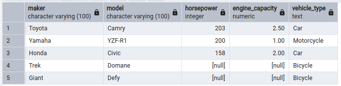

# Практическая работа 1-Vehicles

## Описание

В данной практической работе создаётся база данных транспортных средств в PostgreSQL.

База данных содержит информацию об автомобилях, мотоциклах и велосипедах.

---

## Структура файлов

- `init_db.sql` — создание таблиц и заполнение базы тестовыми данными;
- `task_1.sql` — запрос для поиска спортивных мотоциклов;
- `task_2.sql` — запрос для объединённой выборки транспортных средств.

---

## Запуск

1. Выполнить скрипт `init_db.sql` в PostgreSQL.
2. Выполнить запрос `task_1.sql`.
3. Выполнить запрос `task_2.sql`.

---

## Результаты выполнения

### Задача 1

### Задача 2

