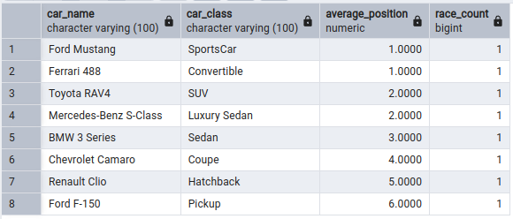
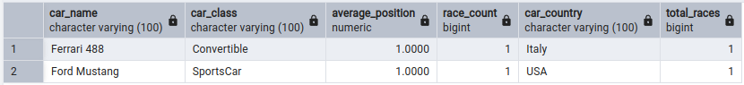
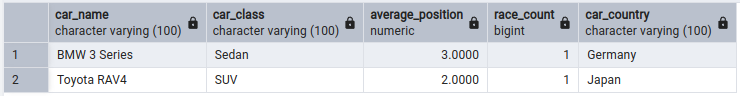

# Практическая работа 2-Races

## Описание

В данной практической работе создаётся база данных автомобильных гонок в PostgreSQL.

База данных содержит информацию о классах автомобилей, автомобилях, гонках и результатах участия автомобилей в гонках.

---

## Структура файлов

- `init_db.sql` — создание таблиц и заполнение базы тестовыми данными;
- `task_1.sql` — запрос для определения автомобилей с наименьшей средней позицией в каждом классе;
- `task_2.sql` — запрос для определения автомобиля с наименьшей средней позицией среди всех автомобилей;
- `task_3.sql` — запрос для определения классов автомобилей с наименьшей средней позицией;
- `task_4.sql` — запрос для определения автомобилей, которые имеют среднюю позицию лучше средней позиции своего класса;
- `task_5.sql` — запрос для определения классов с наибольшим количеством автомобилей с низкой средней позицией.

---

## Запуск

1. Выполнить скрипт `init_db.sql` в PostgreSQL.
2. Выполнить запрос `task_1.sql`.
3. Выполнить запрос `task_2.sql`.
4. Выполнить запрос `task_3.sql`.
5. Выполнить запрос `task_4.sql`.
6. Выполнить запрос `task_5.sql`.

---

## Результаты выполнения

### Задача 1

### Задача 2

### Задача 3

### Задача 4

### Задача 5

