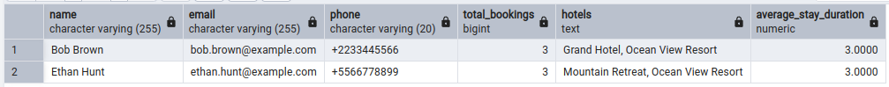
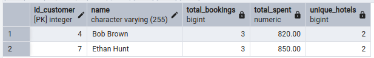
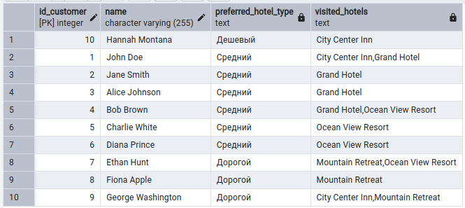

# Практическая работа 3-Hotel

## Описание

В данной практической работе создаётся база данных отелей в PostgreSQL.

База данных содержит информацию об отелях, номерах, клиентах и бронированиях.

---

## Структура файлов

- `init_db.sql` — создание таблиц и заполнение базы тестовыми данными;
- `task_1.sql` — запрос для поиска клиентов, сделавших более двух бронирований в разных отелях;
- `task_2.sql` — запрос для анализа клиентов, которые бронировали номера в разных отелях и потратили более 500 долларов;
- `task_3.sql` — запрос для анализа предпочтений клиентов по типу отелей.

---

## Запуск

1. Выполнить скрипт `init_db.sql` в PostgreSQL.
2. Выполнить запрос `task_1.sql`.
3. Выполнить запрос `task_2.sql`.
4. Выполнить запрос `task_3.sql`.

---

## Результаты выполнения

### Задача 1

### Задача 2

### Задача 3

