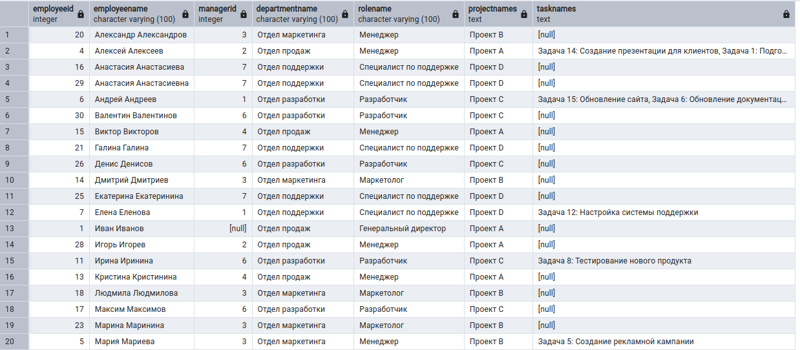
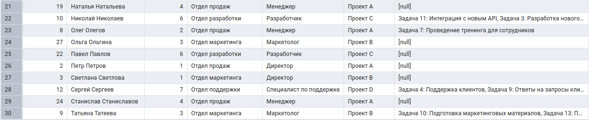
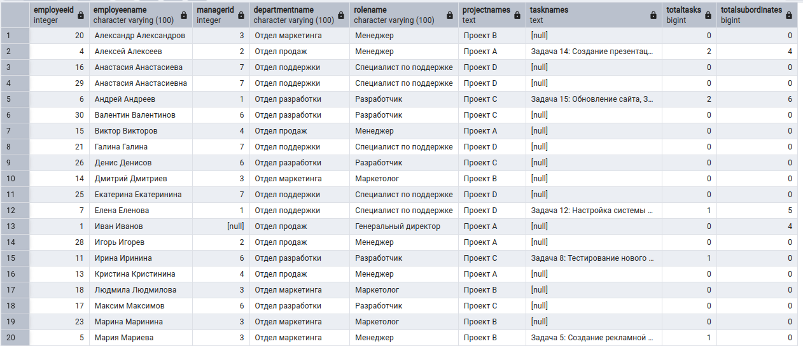
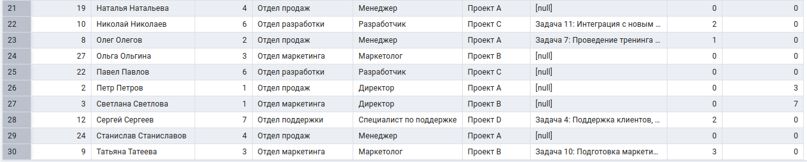
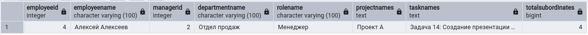

# Практическая работа 4-Tasks

## Описание

В данной практической работе создаётся база данных для хранения информации об отделах, ролях, сотрудниках, проектах и задачах в PostgreSQL.

База данных позволяет анализировать иерархию сотрудников, их подчинённых, проекты отделов и назначенные задачи.

---

## Структура файлов

- `init_db.sql` — создание таблиц и заполнение базы тестовыми данными;
- `task_1.sql` — запрос для поиска Ивана Иванова и всех его подчинённых с использованием рекурсивного запроса;
- `task_2.sql` — запрос для поиска сотрудников в иерархии Ивана Иванова с количеством задач и прямых подчинённых;
- `task_3.sql` — запрос для поиска менеджеров, имеющих подчинённых, с подсчётом всех подчинённых рекурсивно.

---

## Запуск

1. Выполнить скрипт `init_db.sql` в PostgreSQL.
2. Выполнить запрос `task_1.sql`.
3. Выполнить запрос `task_2.sql`.
4. Выполнить запрос `task_3.sql`.

---

## Результаты выполнения

### Задача 1

### Задача 2

### Задача 3

